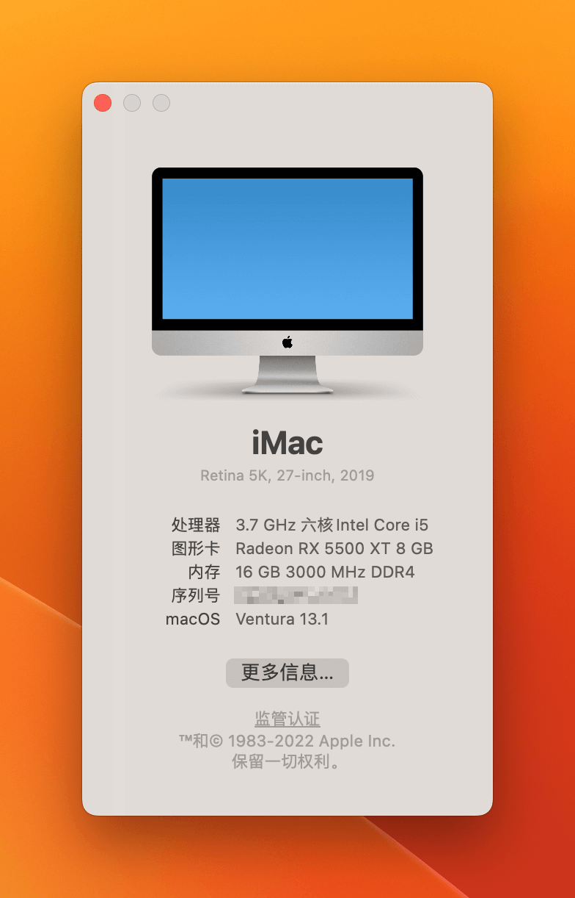

# ASRock Z390m-ITX/ac Hackintosh

## macOS 版本

- 12.0.1 (21A559)

## Opencore 版本

- 0.7.5

## 硬件配置

- Intel Core i5-9600K 3.70GHz
- ASRock Z390M-ITX/ac (BIOS Version: 4.30)
- USCORSAIR DDR4 3000 16GB (8G×2)
- Intel UHD Graphics 630
- Asrock Radeon RX 5500 XT Challenger D 8G OC
- HP SSD EX920 512GB `(macOS Monterey)`
- HP SSD S700 250GB `(Windows 11)`
- BCM94360CS2

## BIOS 设置

- CPU Configuration
  - Intel SpeedStep Technology -> Enabled
  - Intel Turbo Boost Technology -> Enabled
  - Intel Speed Shift Technology -> Enabled

- Advanced
  - CPU Configuration
    - CFG Lock -> Disabled
    - Software Guard Extensions (SGX) -> Disabled

  - Chipset Configuration
    - Primary Graphics Adapter -> PCI Express
    - Above 4G Decoding -> Enabled
    - C.A.M. (Clever Access Memory) -> Enable

      `注：[升级 BIOS](https://www.asrock.com/mb/Intel/Z390M-ITXac/index.cn.asp#BIOS) 到测试版 4.30F 后可以开启 Above 4G Decoding 和 C.A.M，并使用 Opencore 最新的 0.7.5 版本并设置 ResizeAppleGpuBars 为 0，ResizeGpuBars 为 -1 就可以享受 Windows 下 AMD Smart Access Memory 技术带来的提升了`

    - IGPU Multi-Monitor -> Enabled
    - PCI Express Native Control -> Enabled // 可选
    - PCIE ASPM Support -> Auto // 可选
    - PCH PCIE ASPM Support -> Auto // 可选
    
  - Storage Configuration
    - SATA Mode Selection -> AHCI

  - USB Configuration
    - XHCI Hand-off -> Enabled

  - Trusted Computing
    - Security Device Support -> Enable

- Security
  - Secure Boot -> Disabled
  - Intel platform trust technology -> Enable

    `注: 开启 Security Device Support 和 Intel platform trust technology 就打开了 TPM 2.0 支持, 可以安装 Windows 11`

- Boot
  - CSM
    - CSM -> Disabled

## 工作正常

- CPU 变频节能正常
- 休眠唤醒正常
- 核显加速正常
- 5500 XT 显卡性能正常, Geekbench 5.1.1 跑分: Metal Score(41632), OpenCL Score(39026)
- 5500 XT 风扇 PMW 正常
- 5500 XT 温度检测 (使用 [RadeonSensor](https://github.com/aluveitie/RadeonSensor) 实现, 需要开启 RadeonSensor.kext 加载，并使用 [RadeonGadget](Resources/RadeonGadget.app) 读取)
- 有线网卡 (我只启用了一块网卡，请禁用 SmallTreeIntel82576.kext 它在 Monterey 无法正常使用)
- 无线网卡 + 蓝牙
- USB, 使用 [USBToolBox](https://github.com/USBToolBox/tool) 定制 USBMap.kext, [详情](Resources/USB/README.md)
- NVRAM（SSDT-PMC.aml）
- iMessage/FaceTime/Hand-off (修改三码)

## 唯一一点不够完美

- 因为苹果驱动的问题，现在还拿不到显卡的监控数据

## 使用说明

- 先修改三码后再使用
- 如果你的 CPU 和我不一样，请到 Windows 下使用 [SSDTTime](https://github.com/corpnewt/SSDTTime) 生成自己的 SSDT-PLUG.aml
- 如果你的独立显卡和我不一样，请注意 [自定义显卡优化参数](Resources/5500XT/README.md)

## 一些图片

## [更新日志](./CHANGELOG.md)
